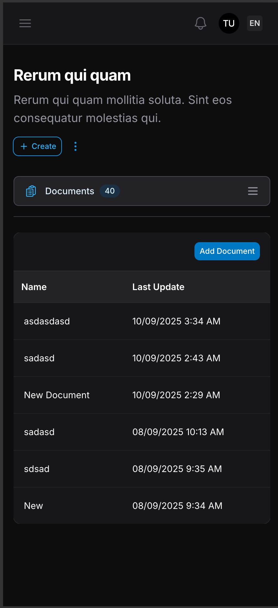
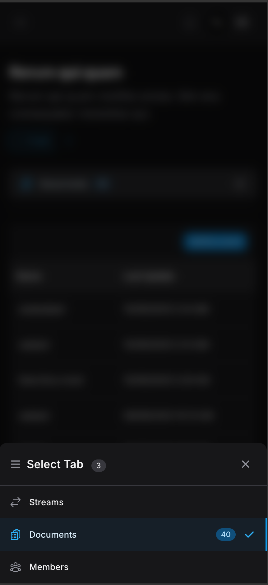

# NapTab 💤

[](https://packagist.org/packages/hdaklue/naptab)
[](https://packagist.org/packages/hdaklue/naptab)

**NapTab** is a Laravel package providing intelligent tabbed navigation with true lazy loading - tabs "nap" (sleep) until clicked, dramatically improving page performance. **4x faster initial load times** (340ms → 80ms) with mobile-first responsive design, RTL support, and seamless Laravel integration. Works perfectly with FilamentPHP, Livewire, and any Laravel package.

## ✨ Core Features

### 🎯 **True Lazy Loading**
Tabs "nap" until needed - database queries and expensive operations only execute when users click tabs, not on page load. **4x faster initial load times** compared to traditional tab libraries.

### 📱 **Mobile-First Design**  
Intelligent device detection with optimized navigation:
- **Desktop**: Horizontal scrolling with hover states
- **Mobile**: Smooth scrolling or bottom-sheet modal navigation

<div align="center">
  
  
  <br>
  <small><em>Mobile-optimized interface with smooth animations and touch-friendly navigation</em></small>
</div>

### 🌐 **Complete RTL Support**
Perfect Arabic, Hebrew, and Persian language support with automatic text direction detection.

### 🔗 **URL Routing**
SEO-friendly bookmarkable tabs with automatic {activeTab?} parameter handling.

### 🎨 **Professional Theming**
22 color schemes with dark/light mode support and 3 visual presets (Modern, Minimal, Sharp).

### 🔧 **Package Integration**
Seamlessly integrates with any Laravel package - FilamentPHP admin panels, custom Livewire components, or traditional Blade views.

## ⚡ Performance

### Load Time Comparison
| Implementation | Initial Load | Improvement |
|---------------|--------------|-------------|
| Traditional Tabs | 340ms | - |
| **NapTab** | **80ms** | **4x faster** |

**Why NapTab is faster:**
- ✅ True lazy loading - only active tab content loads initially
- ✅ Efficient DOM management with strategic Livewire keys
- ✅ Smart route parameter handling without full page reloads
- ✅ Optimized for mobile with minimal JavaScript overhead

## Quick Start

### Installation

```bash
composer require hdaklue/naptab
php artisan naptab:install
```

### Basic Usage

Create a Livewire component extending NapTab:

```php
<?php

namespace App\Livewire;

use Hdaklue\NapTab\Livewire\NapTab;
use Hdaklue\NapTab\UI\Tab;

class DashboardTabs extends NapTab
{
    protected function tabs(): array
    {
        return [
            // Option 1: Controller method (recommended for dynamic content)
            Tab::make('overview', 'Overview')
                ->icon('chart-bar'),
                
            // Option 2: Direct content with closure
            Tab::make('analytics', 'Analytics')
                ->icon('presentation-chart-line')
                ->badge(fn() => $this->getPendingReports())
                ->content(fn() => view('dashboard.analytics', [
                    'data' => $this->getAnalyticsData()
                ]))
                ->visible(fn() => auth()->user()->can('view-analytics')),
                
            // Option 3: Livewire component
            Tab::make('settings', 'Settings')
                ->icon('cog-6-tooth')
                ->livewire(\App\Livewire\UserSettings::class, ['userId' => auth()->id()])
                ->visible(fn() => auth()->user()->can('manage-settings')),
        ];
    }

    // Controller method for Option 1 tabs
    public function overview()
    {
        // This method is called only when the tab is accessed
        $metrics = $this->getOverviewMetrics();
        
        return view('dashboard.overview', compact('metrics'));
    }
    
    // Helper methods (these would be in your actual implementation)
    private function getOverviewMetrics()
    {
        // Heavy database queries only run when this tab is accessed
        return [
            'users' => \App\Models\User::count(),
            'orders' => \App\Models\Order::today()->count(),
            'revenue' => \App\Models\Order::today()->sum('total'),
        ];
    }
    
    private function getAnalyticsData()
    {
        // Complex analytics only computed when user clicks this tab
        return [
            'pageviews' => $this->getPageviews(),
            'conversions' => $this->getConversions(),
        ];
    }
    
    private function getPendingReports()
    {
        return \App\Models\Report::where('status', 'pending')->count();
    }
}
```

### 2. Add to Your Blade Template

```blade
<!-- Simple usage -->
<livewire:dashboard-tabs />

<!-- With URL routing (if routable is enabled) -->
<livewire:dashboard-tabs />

<!-- With custom classes -->
<div class="bg-white dark:bg-gray-900 rounded-lg shadow-lg p-6">
    <livewire:dashboard-tabs />
</div>

<!-- Or use kebab-case component name -->
<livewire:dashboard-tabs />
```

That's it! Your tabs are now "napping" and will only wake up when needed:
- ✅ **True Lazy Loading** - Heavy database queries run only when users click tabs
- ✅ **Performance Boost** - Page loads instantly, content loads on-demand  
- ✅ **Mobile-First** - Intelligent navigation that adapts to device type
- ✅ **RTL Ready** - Perfect right-to-left support for Arabic, Hebrew, Persian
- ✅ **Resource Efficient** - Zero wasted server processing for unused tabs

## Tab API Reference

### Complete Tab Configuration

NapTab provides multiple ways to define tab content, giving you flexibility for different use cases:

```php
<?php

namespace App\Livewire;

use Hdaklue\NapTab\Livewire\NapTab;
use Hdaklue\NapTab\UI\Tab;
use App\Livewire\UserSettings;
use Illuminate\Support\Facades\Gate;

class ComprehensiveTabs extends NapTab
{
    protected function tabs(): array
    {
        return [
            // Method 1: Controller Method (Recommended for complex logic)
            Tab::make('dashboard', 'Dashboard')
                ->icon('chart-bar')
                ->badge(fn() => $this->getNotificationCount())
                ->visible(fn() => auth()->check())
                ->disabled(fn() => $this->isMaintenanceMode())
                ->beforeLoad(fn($tab, $context) => $this->logTabAccess($tab->getId()))
                ->afterLoad(fn($tab, $content, $context) => $this->trackPerformance($tab->getId())),
                
            // Method 2: Direct Content (Simple HTML/Blade)
            Tab::make('about', 'About Us')
                ->icon('information-circle')
                ->content(fn() => '<div class="p-4">
                    <h2>About Our Company</h2>
                    <p>We are a leading provider...</p>
                </div>'),
                
            // Method 3: Blade View (Static content)
            Tab::make('contact', 'Contact')
                ->icon('envelope')
                ->content(fn() => view('pages.contact')),
                
            // Method 4: Livewire Component (Interactive content)
            Tab::make('settings', 'Settings')
                ->icon('cog-6-tooth')
                ->livewire(UserSettings::class, ['userId' => auth()->id()])
                ->visible(fn() => auth()->user()->can('manage-settings'))
                ->onError(fn($tab, $error, $context) => logger()->error('Settings tab error', [
                    'tab' => $tab->getId(),
                    'error' => $error->getMessage()
                ])),
                
            // Method 5: Advanced Configuration with Authorization
            Tab::make('analytics', 'Analytics')
                ->icon('presentation-chart-line')
                ->badge('Pro')
                ->onSwitch(fn($tab, $from, $to, $context) => $this->trackTabSwitch($from, $to)),
        ];
    }

    // Controller method for Method 1
    public function dashboard()
    {
        // Heavy computation only runs when tab is clicked
        $metrics = $this->calculateDashboardMetrics();
        $charts = $this->generateChartData();
        
        return view('dashboard.overview', compact('metrics', 'charts'));
    }
}
```

### Tab API Methods

All Tab methods are chainable and accept either static values or closures for dynamic behavior.

**Core Configuration**
```php
Tab::make('id', 'Label')           // Creates a new tab instance
    ->label('Custom Label')        // Set tab label (string|Closure)
    ->icon('heroicon-name')        // Set Heroicon name (string|Closure|null)  
    ->badge('New')                 // Display badge text (string|Closure|null)
    ->disabled(true)               // Disable tab (bool|Closure, default: false)
```

**Access Control**
```php
Tab::make('admin', 'Admin Panel')
    ->visible(fn() => auth()->user()->isAdmin())           // Control visibility (bool|Closure)
```

**Content Definition**
```php
// Option 1: Controller method (recommended for dynamic content)
Tab::make('dashboard', 'Dashboard') // Automatically calls $this->dashboard() method

// Option 2: Direct content with closure
Tab::make('about', 'About')
    ->content(fn() => view('pages.about'))  // Returns Htmlable content

// Option 3: Livewire component
Tab::make('settings', 'Settings')
    ->livewire(UserSettings::class, ['userId' => 123]) // Component class and params
```

**Lifecycle Hooks** 
```php
Tab::make('analytics', 'Analytics')
    ->beforeLoad(function($tab, $context) {
        // Called before tab content loads
        logger()->info("Loading tab: {$tab->getId()}");
    })
    ->afterLoad(function($tab, $content, $context) {
        // Called after content is loaded
        $this->trackTabView($tab->getId());
    })
    ->onError(function($tab, $error, $context) {
        // Called when tab loading fails
        $this->logTabError($tab->getId(), $error->getMessage());
    })
    ->onSwitch(function($tab, $fromTabId, $toTabId, $context) {
        // Called when switching to this tab
        $this->analyzeTabFlow($fromTabId, $toTabId);
    });
```

### Tab Content Methods

**1. Controller Methods (Best for Dynamic Content)**
```php
public function reports()
{
    // Database queries only execute when user clicks this tab
    $reports = Report::with('author')
        ->where('status', 'published')
        ->latest()
        ->paginate(20);
        
    return view('tabs.reports', compact('reports'));
}
```

**2. Direct Content**
```php
Tab::make('terms', 'Terms of Service')
    ->content('<div class="prose max-w-none">
        <h1>Terms of Service</h1>
        <p>By using our service...</p>
    </div>')
```

**3. Blade Views**
```php
Tab::make('faq', 'FAQ')
    ->content(view('pages.faq', ['categories' => $this->getFaqCategories()]))
```

**4. Livewire Components**
```php
Tab::make('chat', 'Live Chat')
    ->livewire(ChatWidget::class, [
        'room' => 'support',
        'user' => auth()->user()
    ])
```

### Dynamic Badges & Content Examples

```php
Tab::make('inbox', 'Messages')
    ->badge(fn() => auth()->user()->unreadMessages()->count())
    ->visible(fn() => auth()->check())
    
Tab::make('notifications', 'Notifications')
    ->badge(function() {
        $count = auth()->user()->unreadNotifications()->count();
        return $count > 99 ? '99+' : (string) $count;
    })
    ->beforeLoad(fn($tab) => $this->markNotificationsAsRead())
```

## Configuration Reference

### Global Configuration

Configure NapTab globally in your `app/Providers/NapTabServiceProvider.php`:

```php
<?php

namespace App\Providers;

use Hdaklue\NapTab\Services\NapTabConfig;
use Hdaklue\NapTab\Enums\{
    TabStyle, TabColor, TabBorderRadius, Shadow, 
    TabSpacing, TabBorderWidth, TabTransition, 
    TabTransitionTiming, BadgeSize, ContentAnimation
};
use Illuminate\Support\ServiceProvider;

class NapTabServiceProvider extends ServiceProvider
{
    public function register()
    {
        $this->app->singleton('naptab.config', function () {
            return NapTabConfig::create()
                // Preset styles - applies multiple settings at once
                ->style(TabStyle::Modern)                    // Modern | Minimal | Sharp
                
                // Visual customization
                ->color(TabColor::Blue, TabColor::Gray)      // Primary & secondary colors
                ->radius(TabBorderRadius::Medium)            // Border radius
                ->shadow(Shadow::Large, 'shadow-blue-500/20 dark:shadow-blue-400/30')
                ->border(TabBorderWidth::Thick, true)        // Width & double border
                ->spacing(TabSpacing::Normal)                // Tab spacing
                ->transition(TabTransition::Duration300, TabTransitionTiming::EaseInOut)
                
                // Badge customization  
                ->badgeRadius(TabBorderRadius::Full)
                ->badgeSize(BadgeSize::Medium)
                
                // Content animation
                ->contentAnimation(ContentAnimation::Fade)
                
                // Mobile navigation
                ->navModalOnMobile(false)                    // true = modal, false = scroll
                
                // URL routing
                ->routable(true);                            // Enable {activeTab?} parameter
        });
    }
    
    public function boot()
    {
        // Service provider boot logic
    }
}
```

### Available Configuration Methods

**Core Configuration**
```php
NapTabConfig::create()                              // Create new config instance
    ->style(TabStyle $style)                        // Modern | Minimal | Sharp preset
    ->color(TabColor $primary, TabColor $secondary) // Theme colors  
    ->radius(TabBorderRadius $radius)               // Border radius
    ->shadow(Shadow $shadow, ?string $color)        // Shadow size and custom color
    ->border(TabBorderWidth $width, ?bool $double)  // Border width and double border
    ->spacing(TabSpacing $spacing)                  // Small | Normal | Large
    ->transition(TabTransition $duration, ?TabTransitionTiming $timing)
```

**Badge Configuration** 
```php
->badgeRadius(TabBorderRadius $radius)              // Badge border radius
->badgeSize(BadgeSize $size)                        // Small | Medium | Large
```

**Content & Mobile**
```php
->contentAnimation(ContentAnimation $animation)     // Content transition animation
->navModalOnMobile(bool $useModal = true)          // Mobile modal navigation
->routable(bool $enabled = true)                   // URL routing with {activeTab?}
```

### Preset Styles

Each preset applies multiple settings for a cohesive design:

**Modern Style**
```php
->style(TabStyle::Modern)
// Rich visual experience with shadows, thick borders, large badges
```

**Minimal Style** 
```php
->style(TabStyle::Minimal)
// Clean design with no shadows, thin borders, small badges, compact spacing
```

**Sharp Style**
```php
->style(TabStyle::Sharp) 
// Bold geometric design with no shadows, no borders, no rounded corners
```

## Installation Guide

### 1. Install Package

```bash
composer require hdaklue/naptab
```

### 2. Install Assets & Configuration

```bash
php artisan naptab:install
```

This command will:
- Create `app/Providers/NapTabServiceProvider.php` with default configuration
- Publish CSS assets to `public/vendor/naptab/`
- Add the service provider to your `config/app.php`

### 3. Include CSS Assets

Add to your main layout file:

```blade
{{-- In resources/views/layouts/app.blade.php --}}
@vite(['resources/css/app.css', 'resources/js/app.js'])
<link href="{{ asset('vendor/naptab/naptab.css') }}" rel="stylesheet">
<link href="{{ asset('vendor/naptab/naptab-safelist.css') }}" rel="stylesheet">
```

### 4. Add Service Provider (Auto-added by install command)

```php
// config/app.php
'providers' => [
    // ...
    App\Providers\NapTabServiceProvider::class,
],
```

## Mobile Navigation

NapTab provides intelligent mobile navigation that adapts to device capabilities:

### Scroll Navigation (Default)
- Horizontal scrolling with hidden scrollbars
- Smooth snap-to-item behavior  
- Auto-scroll to active tab
- Touch-friendly interaction

### Modal Navigation (Optional)
```php
->navModalOnMobile(true)
```
- Full-width active tab button with hamburger icon
- Bottom sheet modal with all tabs
- Consistent with mobile design patterns

## URL Routing

Enable URL routing to make tabs bookmarkable and SEO-friendly:

### 1. Enable Routing
```php
// In your NapTabServiceProvider
->routable(true)
```

### 2. Add Route Parameter
```php
// routes/web.php
Route::get('/dashboard/{activeTab?}', DashboardTabs::class)->name('dashboard');
```

### 3. Automatic Navigation
NapTab automatically:
- Updates the URL when tabs are clicked
- Maintains all existing route parameters
- Handles browser back/forward navigation
- Gracefully falls back when route names are unavailable

## CSS Customization

### Published CSS Files

The `naptab:install` command publishes two CSS files:

**`public/vendor/naptab/naptab.css`** - Core component styles
```css
/* Core tab navigation styles */
.naptab-scroll-behavior {
    scroll-behavior: smooth;
    scrollbar-width: none;
    -ms-overflow-style: none;
}
```

**`public/vendor/naptab/naptab-safelist.css`** - Tailwind color safelist
```css
/* Prevents Tailwind from purging dynamic color classes */
@source inline("{hover:,focus:,dark:}bg-blue-{50,500,900/20}");
```

### Custom Colors

To add custom colors, update the safelist file:

```css
/* public/vendor/naptab/naptab-safelist.css */
@source inline("{hover:,focus:,dark:}bg-purple-{50,500,900/20}");
@source inline("{hover:,focus:,dark:}text-purple-{200,600,700}");
```

## Testing

Run the package test suite:

```bash
composer test
```

## Security

If you discover any security-related issues, please email hassan@daklue.com instead of using the issue tracker.

## License

The MIT License (MIT). Please see [License File](LICENSE.md) for more information.

## Credits

- **[Hassan Ibrahim](https://github.com/hdaklue)** - Creator & Maintainer
- **[Laravel](https://laravel.com)** - The foundation framework
- **[Livewire](https://livewire.laravel.com)** - Real-time interactions
- **[Tailwind CSS](https://tailwindcss.com)** - Styling framework